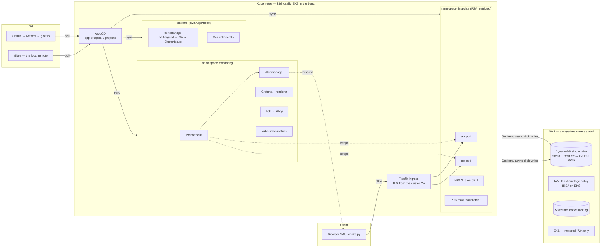

# LinkPulse — Architecture

What the system is, how a request moves through it, how it is deployed, and the
trade-offs that other files cite this document for. Decisions are recorded where they
were made — the tracker has the full history — and this is the map that ties them
together.

## The system in one diagram

Locally, `DynamoDB` is LocalStack in Docker Compose, reached from the cluster through a
selectorless Service; EKS does not exist. On the burst, the same manifests deploy with a
different overlay (`k8s/manifests/overlays/aws`: an ALB ingress class, an IRSA
annotation, and no Secret), and ArgoCD reads GitHub instead of Gitea. Everything else is
byte-identical, which is the portability claim in one sentence.

## The request path

**Redirect** (`GET /r/{code}`, the product): Traefik → pod → one eventually-consistent
`GetItem` on `PK=LINK#<code>` → `302` → and, *after* the response is on its way, a click
is enqueued in memory. Eight workers drain the queue: a `PutItem` for the CLICK item and
an `UpdateItem ADD` on one of sixteen CLICKSTAT shards. The redirect never waits for
either. Saturation therefore appears as **dropped clicks**, never as slow redirects, and
the alerting is shaped by that (`docs/runbook.md#clicks-dropped`).

**GraphQL** (`/graphql`): `shortenUrl`, `link`, `links`, with `clicksByDay` and
`recentClicks` under a link. Every resolver maps to one access pattern in
`docs/data-model.md`; the IAM policy grants exactly the five DynamoDB actions those
patterns need and explicitly denies `Scan`.

**Probes**: `/healthz` says the process is alive and checks nothing else; `/readyz` pings
the table and takes the pod out of the Service when it cannot. That split is what makes a
dependency outage a *readiness* event with zero restarts rather than a crash loop
(`chaos-3`), and it is pinned by a test.

## Layers, and who owns what

| Layer | Lives in | Applied by | Notes |
|---|---|---|---|
| Cloud resources | `infra/terraform` | Terraform, four environments | `local` (LocalStack, CI), `bootstrap` (state bucket, local state), `aws` (always-free), `aws-burst` (metered, separate state so `destroy` cannot reach the table) |
| Cluster | `k8s/k3d/cluster.yaml` / EKS module | k3d / Terraform | three nodes locally so drains, PDBs and topology spread are real |
| Platform | `platform/` | ArgoCD `platform` project (wave −2) | cert-manager with an in-cluster CA; Sealed Secrets with a backed-up key |
| Application | `k8s/manifests` | ArgoCD `linkpulse` project (wave 0) | base + `local`/`aws` overlays; hash-named ConfigMap so config changes roll pods |
| Monitoring | `monitoring/` | ArgoCD `linkpulse` project (wave 1) | plain manifests, no operator; 13 alert rules, 3 dashboards as committed JSON |
| Delivery | `.github/workflows/ci.yml`, `gitops/argocd` | GitHub Actions, ArgoCD | test → validate → render → Trivy gate → push by digest; ArgoCD polls, prunes, self-heals |
| Operations | `scripts/`, `mise.toml` | the ops container | backup/restore, cost, metered-resource audit, TLS and sealing checks, five chaos experiments |

Two ArgoCD projects rather than one, deliberately: the application's project cannot
install a CRD or a webhook, and the platform's can. The boundary is a diff someone has to
read.

## Trade-offs other files point here for

### The GraphQL schema is built in code, and there are no subscriptions

`internal/gql/schema.go` constructs the schema programmatically. gqlgen would add a
`go generate` step that CI must both run and verify is not stale; for a schema of five
fields and one mutation the generator costs more than it returns. Subscriptions were cut
for a similar reason: a live click feed needs a WebSocket path through the ingress, a
connection-aware load balancer on EKS, and a fan-out layer — for a dashboard that polls
`recentClicks` every few seconds and cannot tell the difference. The trigger to revisit
both: a schema large enough to want types generated for the client, or a consumer that
needs sub-second delivery.

### Burst nodes run in the public tier, without a NAT Gateway

`infra/terraform/modules/eks` places nodes in the public subnets by default. Private
nodes are better practice and need a NAT Gateway to pull images: ~$0.045/hour plus per-GB,
about $3.24 over 72 hours before data — against ~$0.72 for two public IPv4 addresses. The
private tier exists, is routed, and is one variable away; the DynamoDB gateway endpoint
means the application's data path never crosses the internet in either tier. The
security group on the nodes admits nothing inbound but the control plane and the ALB.
This is a cost decision for a 72-hour window with a $25 ceiling, and it would be the
wrong one for a cluster that lived longer than its own bill cycle.

### The AWS provider is current, and LocalStack has a floor

`hashicorp/aws ~> 6.64` everywhere. Provider 6.13 and later create a DynamoDB table and
then fail to find it on LocalStack 4.9 and older; 4.14 fixes it. So the LocalStack pin
(`docker-compose.yml`) is a floor that the provider version depends on, not a preference,
and dropping either breaks `terraform apply` in CI while leaving real AWS fine — the
worst shape of failure to debug. The tracker's phase 4 has the bisection.

### A single table, 20/20 plus 5/5 on the index

`docs/data-model.md` is the design and the argument: access patterns first, keys derived
from them, the hot-partition failure named as the thing the design exists to survive.
The capacity split is the free-tier arithmetic: 25 units per side is the *account's*
allowance and the index's provisioned capacity counts against it, which the first cut of
the module got wrong (phase-8 finding 1; `scripts/metered-resources.py` now guards it).

### Everything runs in containers; Docker and mise are the host prerequisites

No Go, Terraform, kubectl, Python or k6 on the host. Every task in `mise.toml` is a
single tool invocation inside a pinned image, with `A || B` the only control flow, so the
same file runs through `sh` on macOS and Linux and through `cmd` on Windows. The k3d image
has no shell at all, which is what forced that discipline. `scripts/bootstrap.sh` and
`.ps1` are the one deliberate duplicate: the step that installs the task runner cannot be
a task.

### TLS from a CA the cluster owns, not mkcert

The plan said mkcert. `mkcert -install` writes into the host's trust store — the one
class of host mutation this project refuses (the ingress uses `localtest.me` rather than
a hosts-file edit for the same reason). cert-manager with a self-signed root and a CA
ClusterIssuer keeps the private key in the cluster, issues per-Ingress certificates from
an annotation, renews them, and is declared in git. Trusting the CA on the host is
optional; the checks that prove TLS works pass the CA explicitly.

### What is injected, and what is real

Two of the five chaos experiments inject their fault rather than induce it, and say so:
experiment 1 because LocalStack does not enforce provisioned capacity (real DynamoDB does,
and the burst runs the same traffic un-injected), experiment 4 because a Go service does
not reliably cross a memory limit under load. What follows the injection — the exception
and the drop, the OOM kill and the backoff, the alerts and the panels — is genuine in
every case. Experiments 2, 3 and 5 inject nothing.

## What is verified, and where

| Claim | Verified on | Not yet |
|---|---|---|
| Terraform applies and is idempotent | LocalStack (local, CI) | any real account |
| Manifests deploy, probes pass, ingress routes, TLS chains | k3d, three nodes, 1.34 | EKS |
| GitOps: commit → sync → roll; revert → roll back; selfHeal | k3d + Gitea + ArgoCD | GitHub as the remote |
| Alerts fire on real failures | every rule the experiments target, on k3d | the CloudWatch exporter's series |
| Backup restores byte for byte | LocalStack | real DynamoDB |
| Cost report, metered audit, burst up/down | validated only | everything |

The right-hand column is the burst's job (`docs/burst-runbook.md`).
