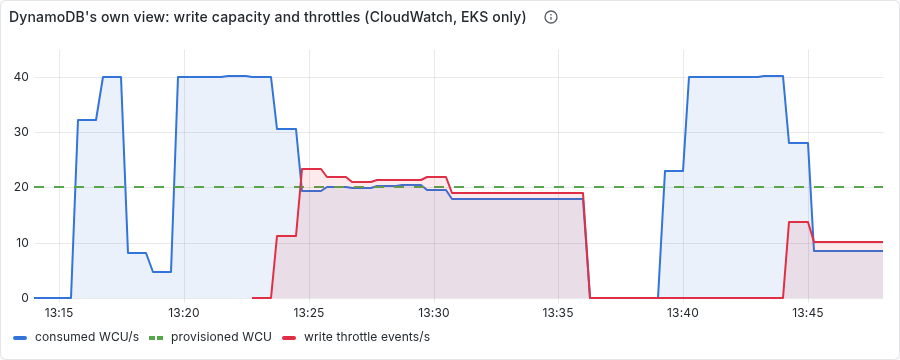

# LinkPulse — Case Study

A URL shortener with click analytics, built to be *operated* rather than merely to run:
the point was never the product but everything around it — a DynamoDB data model with
its failure mode designed in, infrastructure as code that applies against a mock in CI
and a real account on demand, a three-node Kubernetes cluster deployed by GitOps, a
monitoring stack whose alerts were proven by inducing the failures they describe, and
the automation to do all of that from a laptop with Docker and a task runner and nothing
else installed.

Two constraints shaped every decision: **$0** (an always-free AWS tier, with one
budgeted burst of metered time, which in the end ran twelve hours and cost $3.32), and
**no host installs** — the whole thing has
to work on a machine where the operator cannot run `apt`, edit `/etc/hosts`, or import a
certificate. The second constraint turned out to be the more interesting one.

## What it is

A Go service with two paths. The redirect (`/r/{code}`) does one DynamoDB read, answers
302, and enqueues a click that eight background workers write later — so throttled
writes show up as lost analytics, never as slow redirects, and the alerting is built
around that fact. A GraphQL API creates links and reads their stats. One DynamoDB table,
provisioned at exactly the account's free allowance (20/20 on the table, 5/5 on the
index), with the click aggregate sharded across sixteen keys because a popular link is a
hot partition by construction.

Around it: Terraform in four environments (LocalStack for CI, a state bucket, the
always-free account, the metered burst — the last in its own state file so that
`destroy` is *incapable* of reaching the table); a k3d cluster pinned to the same minor
version as EKS; ArgoCD with an app-of-apps and two projects (the application's cannot
install a CRD; the platform's can); cert-manager issuing every ingress a certificate
from a CA the cluster owns; Sealed Secrets for the two values that are real on EKS;
Prometheus, Alertmanager, Grafana, Loki; and a set of scripts that back the table up,
audit what the account is spending, and run five chaos experiments that leave timelines
and rendered panels behind.

`docs/architecture.md` has the diagram; `tracker.md` has every decision with its
reasoning and every claim with the evidence that verified it.

## The numbers

Measured on k3d (three nodes, Docker Desktop for Windows) with LocalStack behind the
table. The next section re-measures on EKS against real DynamoDB.

**Baseline**, two minutes at 20 redirects/s and 2 GraphQL/s: redirect p50 12.9 ms,
p95 105 ms, p99 180 ms; zero failures; zero dropped iterations. The tail is DynamoDB
Local's — its `GetItem` p99 reaches a full second at 40/s while the nodes sit 80% idle —
so the thresholds are calibrated to it and the burst is expected to come in far under.

**Five experiments**, each codified and run to green, each ending with a 29-assertion
check that the monitoring stack is still observing:

| # | Failure | What happened, timed |
|---|---|---|
| 1 | DynamoDB refuses half of all click writes while 20 redirects/s hit one link | first drop 10 s in; alert 65 s in; **redirect p99 25 ms vs 21 ms clean; zero 5xx**; half the clicks lost and counted |
| 2 | A deploy whose pods start but never serve, shipped through GitOps | old pods kept serving; `ProgressDeadlineExceeded` at 204 s; alert and ArgoCD Degraded at 285 s; `git revert` rolled it back in 109 s, nobody touched the cluster |
| 3 | The datastore vanishes | process not-ready 17 s; both alerts at 92 s, the per-pod one inhibited; **0 restarts**; 5 s to recover |
| 4 | A pod leaks memory past its limit, five times | warning at 94 s; OOMKilled at 107 s, alert at 127 s; CrashLoopBackOff alert on the fifth kill; the other replica served throughout |
| 5 | A node is drained, then stopped | drain: one eviction allowed by the PDB, replacement ready in 7 s; stop: NotReady at 49 s, alerts at ~135 s, **285 s on one replica** until the taint eviction; redirects served throughout |

## The same system on EKS

One day, 2026-09-24: EKS 1.34 on four t3.small nodes in ap-south-1, the application and
its monitoring deployed by ArgoCD from this repository, pods reaching DynamoDB through
IRSA with no stored credential. It stayed up twelve hours, nine of them idle with no
restarts or evictions, and was destroyed that evening. `docs/evidence/burst/` has every
run, including the ones that failed.

| | Local (k3d, LocalStack) | EKS, real DynamoDB |
|---|---|---|
| Baseline redirect latency, client side | p95 105 ms, p99 180 ms | p95 83 ms, p99 155 ms, from a laptop in India to Mumbai: 28 ms of every request is the network |
| Redirect p99, server side, clean | 21 ms | 5 ms. DynamoDB Local was the slow part |
| 1. Write throttling | injected (50% of writes refused); first drop 10 s, alert 65 s; p99 25 ms; zero 5xx | **nothing injected**; the table spent its burst credit first, then throttled 6.6 writes/s; alert 30 s after the first drop; p99 7 ms; zero 5xx in 7,202 requests |
| 3. Datastore gone | all pods unready at 17 s, recovered 5 s after | **failed as an experiment, finding below**: one pod unready at 80 s, the other never; recovery 4 min after the fix |
| 5. Node drained | replacement ready in 7 s | **failed, finding below**: the replacement never scheduled |
| 2, 4 | passed | not run on EKS, by decision (below) |

**Experiment 1 is the result the data model was written for.** Twenty redirects a second
on one link is forty write units a second against a table provisioned for twenty. For
about five minutes nothing happened: DynamoDB banks up to 300 seconds of unused capacity
as burst credit, and the table spent it. Then it throttled, the drop counter moved, both
alerts fired thirty seconds later, and every redirect still answered 302 in single-digit
milliseconds. DynamoDB's own view, from CloudWatch through an exporter that had never run
before that day:

Consumed capacity at twice the provisioned line while the credit lasts, then clamped to
exactly twenty as throttle events rise to meet the difference: demand of forty, served
twenty, refused twenty. Two runs are in the graph; the first ran its load longer than
the experiment expects and failed a check for that reason, so it was rerun.

**Experiment 3 failed, and taught more than a pass would have.** On EKS the datastore
cannot be paused, so the injection is the one real outages come from: the IAM policy is
detached from the pods' role, then re-attached. One pod was denied eighty seconds after
the detach. The other was never denied in the two minutes the policy was gone. After the
policy was restored, the denied pod stayed denied for four more minutes. IAM is
eventually consistent per session, and the experiment assumed a switch. For a runbook:
reverting a bad IAM change does not end the incident; expect minutes more of
`AccessDenied`.

**Experiment 5 failed in its first half.** The drain evicted the application's replica
through its disruption budget in seven seconds, and the replacement never started:
`0/4 nodes are available: 1 node(s) were unschedulable, 3 Too many pods`. Every free
pod slot in the cluster was on the node being drained. The application ran on one
replica for four minutes, serving every request. A disruption budget limits how many pods
leave; it cannot make room for them to land. The second half, stopping the instance,
was not run, because with the same capacity it could only restate this.

**Experiments 2 and 4 were not run on EKS, by decision.** Experiment 4 triggers memory
exhaustion through a debug endpoint that only the local overlay enables, because an
internet-facing deployment should not have one. Experiment 2 would have meant pushing a
deliberately broken image to the public registry and a bad commit to the public `main`,
to prove what the local run proves. ArgoCD's sync from GitHub ran on EKS all day: every
fix in the burst reached the cluster that way. Only the broken-deploy-then-revert
sequence went unexercised.

**It cost $3.32**: $1.47 of EKS control plane, $0.99 of nodes, $0.34 of public IPv4,
$0.29 of load balancer, the rest disks and CloudWatch queries. Credits went from $200.00
to $196.67, which agrees to the cent. Twenty-eight cents of it bought nothing: the laptop
slept four minutes into the teardown, Terraform froze between deleting the node group and
deleting the cluster, and the control plane billed until it woke up 2 h 48 m later.

## What was found

The project's value is less in what it demonstrates than in what building it turned up.
In order of how much each would have cost:

**The always-free environment was not free.** The table was provisioned at 25/25 and the
index at 5/5, and the module validated the table alone against the 25-unit allowance —
which is per account and includes indexes. Thirty units per side is roughly $3 a month on
an environment whose one defining property is $0. Found by the new `metered-resources.py`
on its first run against LocalStack, in phase 8, before any real account existed. The
table is 20/20 now and the module validates the sum.

**Two alert rules could never fire.** `LinkpulseMemoryNearLimit` and
`LinkpulseBelowMinReplicas` joined series from different exporters with a bare operator;
PromQL matches on the full label set, so both were permanently empty — loaded, healthy,
and silent. They passed the observability check for two phases and one cluster rebuild.
Experiment 4's harness found the first by querying the expression before injecting
anything; experiment 5's first run found the second by holding the deployment at one
replica for five minutes with no alert. `docs/postmortem.md` is the write-up.

**An experiment can be dead in the same way a rule can.** Experiment 4 asserted the
CrashLoopBackOff alert by checking for it after each OOM-killed container had restarted —
by which point the waiting reason the rule depends on had already cleared. On my machine it
passed, because the alert had not resolved yet at the moment of the check. The first time CI
ran it, it failed six kills out of six, with backoff reaching 177 s: a rule firing correctly,
and a harness looking at the wrong moment. It now watches inside the backoff gap, while the
condition is true. The table above is from the earlier run; the numbers are real, the
observation method behind the fifth-kill figure was not sound. Re-run in CI with the fix,
the answer was the same kill — the fifth — but now seen 78 s into that backoff gap while
the waiting reason held, at 335 s. The three watched gaps before it (the first kill has no
watch) are logged closing at 39 s, 27 s and 57 s — each short of the rule's minute — which
is the experiment showing its working.

**LocalStack does not enforce provisioned capacity**, and a compose comment said it did.
Measured: 78 write units per second against a 20-unit table, zero throttles. Experiment 1
now injects `ProvisionedThroughputExceededException` through LocalStack's runtime config
API — the exception, the retry, the drop, the alert are all real; only DynamoDB's reason
is not — and the burst runs the same traffic un-injected.

**The sharding mitigation cannot be demonstrated on a 20-WCU table.** A table this small
has one partition; the per-partition ceiling (1000 WCU) is fifty times the table's, so
throttling at 20 is the table's bucket, not a hot key's, and sixteen shards versus one
should throttle identically on the burst. The design is right at scale and the evidence
for it is the write distribution (verified: sixty clicks over sixteen keys). This was
recorded as the honest expectation before the burst rather than discovered on the clock,
and the burst bore it out: consumption clamped at exactly the table's 20 units, the
table's bucket rather than a partition's. It ran sixteen shards only; the sixteen-versus-
one comparison was not run, because it could not have told the two apart.

**A provider/LocalStack incompatibility, bisected rather than worked around.** AWS
provider 6.13+ cannot see a DynamoDB table it just created on LocalStack ≤ 4.9. The
tempting fix was a provider pin; the right one was a LocalStack floor, found by testing
both directions. The pin would have broken real AWS while looking fine locally.

**The IRSA trust policy named a service account that does not exist.** `linkpulse-api`
in Terraform, `linkpulse` in the manifests. On EKS this is `AccessDenied` inside the pod
with nothing wrong on either side individually. Found while writing the burst runbook,
which is what runbooks written before the clock starts are for.

**The GitOps path had never been built from nothing.** The phase that verified it ran on
a cluster `dev` had already filled with `kubectl apply`, and ArgoCD "adopted" everything
with no diff. The first `clean && gitops` from an empty cluster, on a second machine,
found three defects behind one another. ArgoCD 3 ignores EndpointSlices, so the
hand-written one that routes the application to LocalStack was never applied. The health
check that makes sync waves wait read a child application as Healthy while it was still
syncing, so the waves ordered nothing: the application started syncing five seconds
into cert-manager's twenty. And a wait trusted ArgoCD's summary over the workloads it
summarised. The same machine found two more first-run defects of its own: SELinux, which
blocks containers from a bind mount or the Docker socket, and a `certs/` directory that
only existed on the machine that had created it by hand.

**Draining a node takes the observers with it.** Traefik, CoreDNS, Prometheus,
Alertmanager, kube-state-metrics and Grafana are single replicas with no disruption
budgets; the first attempt at experiment 5 evicted the harness's own eyes. The experiment
now moves them off the target first and says why a production cluster would not need to.

**Smaller, and all recorded in the tracker:** `git revert -q` is not a flag (made twice,
caught both times by an assertion on the cluster rather than on the exit code); a
Prometheus `CounterVec` exports nothing until its first observation, so a rate over it
returns *no data* rather than zero and the experiment-1 alert would have been blind;
`kubectl wait --for=create` with two resource names fails instead of waiting; the
kube-state-metrics liveness probe pointed at a path that returns 404 and the kubelet
killed a healthy exporter every 45 seconds; Docker Desktop's VM clock can jump half an
hour mid-experiment.

## What only AWS showed

Thirteen defects surfaced only on EKS. None could have appeared locally or in CI,
because k3d, LocalStack and a Docker network lack the property that broke. Grouped by
what they teach:

**On EKS, capacity is pods, not cores.** The AWS VPC CNI gives each node as many pods as
its network interfaces have addresses: eleven on a t3.small. Two nodes, the planned
cluster, could not hold the project's thirty pods, and eight monitoring pods sat Pending
while both nodes were half idle. The DaemonSets that ship metrics and logs had no
priority, so ordinary pods filled two nodes first and left them silently unmonitored.
The node-loss experiment then failed for the same reason. k3d has no pod cap, so every
local run fit.

**The account is part of the platform.** A Free plan AWS account launches only Free Tier
eligible instance types. My resize to t3.medium was refused *after* Terraform had
destroyed the old node group, and the cluster ran with no nodes for a few minutes. The
eligible list was one API call away, and I checked it only after the failure. Four
t3.small nodes turned out cheaper than the medium plan anyway.

**"The same manifests deploy to EKS unchanged" was not true on the day.** EKS ships no
metrics-server, so the autoscaler read `cpu: <unknown>`. The load balancer controller
refused to build anything for an HTTPS listener with no certificate. The monitoring
ingresses still named `traefik`, which the controller's webhook rejects: Grafana,
Prometheus and Alertmanager were unreachable all day while their pods ran fine. On the
shared load balancer, the application's catch-all rule sorted ahead of the monitoring
hosts and answered for all of them. Five manifest changes later, the claim holds, and it
is measured now rather than reasoned.

**Real CloudWatch is not LocalStack's silence.** On its first run the exporter returned
NaN for everything: DynamoDB publishes provisioned capacity every five minutes, and a
sixty-second window missed it; idle counters publish nothing rather than zero. And no
dashboard had ever displayed its series. The graph above exists because both were fixed
during the window.

**The small ones.** A Terraform `count` that depended on an ARN the same apply creates,
so the first real plan failed. An ArgoCD sync that could not apply the fix to the
DaemonSets until the DaemonSets were healthy. A log check that only passed on clusters
fresh enough to have recent logs.

**And one about the data model.** A click is two writes, the record and then the
aggregate increment, and they are not atomic. Under throttling a handful of clicks had
their record written and their increment refused, so the aggregate can undercount the
feed. That is acceptable for analytics already allowed to drop under throttling, but it
had been an unstated property of the design until the burst stated it.

## What the constraints bought

The **no-host-installs** rule was expected to be a nuisance and turned out to be a design
pressure. Every task is a single tool invocation inside a pinned image, because the k3d
image has no shell and Windows has no `sh`; that made the task file readable by anyone
and identical on three operating systems. TLS came from an in-cluster CA instead of
mkcert, because `mkcert -install` mutates the host — and the in-cluster version renews
itself and is declared in git. The ingress uses `localtest.me` because a hosts-file edit
needs administrator rights. None of these were the first idea; all of them are better
than the first idea.

The **$0** rule made cost a property to be measured rather than a bill to be read. The
metered-resource audit exists because `terraform destroy` cannot see an ALB the load
balancer controller created; the backup script paces itself under the table's read
allowance because an unpaced `Scan` would throttle the application it protects; the
burst environment is a separate state file because the most dangerous command in the
project has to be safe to run in a hurry.

## What is not done, and what is next

Chaos 2 and 4 on EKS, by decision, as above. The second half of experiment 5, which
wants a fifth node's worth of headroom to mean anything. The sixteen-shards-versus-one
comparison, which needs a table large enough to have more than one partition. HTTPS on
the load balancer, which needs a certificate in ACM. Replicas and disruption budgets for
the monitoring stack, and CoreDNS spread across nodes: on EKS both of its replicas landed
on one node. Tags on the node instances and the load balancer, so the cost report can
attribute them: $1.85 of the $3.32 is "untagged". And `mise run` under Windows' `cmd`.
The tracker's "known loose ends" is the complete list.

What I would do differently: write the experiments before the alert rules, not after.
The rules were the deliverable and the experiments the demonstration; it should have
been the other way round, and for the two rules that could never fire, it eventually was.
And build every environment from nothing at least once before calling it verified. The
GitOps path counted as verified from phase 6 onward, and nothing had ever started it from
an empty cluster.

## Reading order

1. `README.md` — how to run it (fifteen minutes cold, one warm).
2. `docs/architecture.md` — the diagram and the trade-offs.
3. `docs/data-model.md` — the design that everything else serves.
4. `docs/evidence/chaos-*/timeline.md` — what the failures actually looked like.
5. `docs/evidence/burst/README.md` — the same experiments on EKS, and what failed there.
6. `docs/postmortem.md` — the incident the project had with itself.
7. `docs/runbook.md` — what to do when each alert fires.
8. `tracker.md` — every decision, every bug, every verification, in order.
