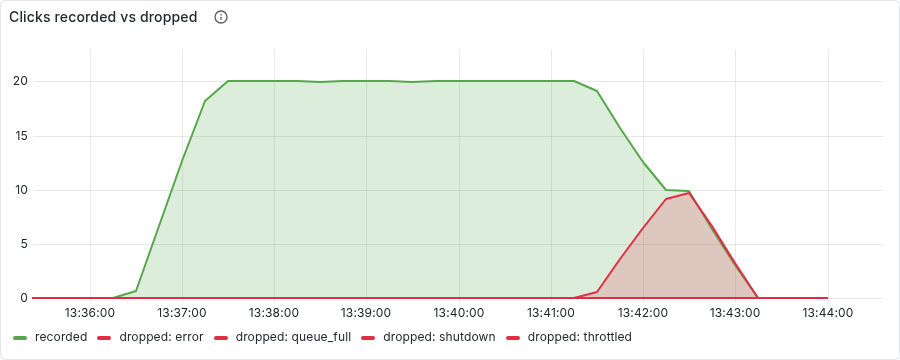
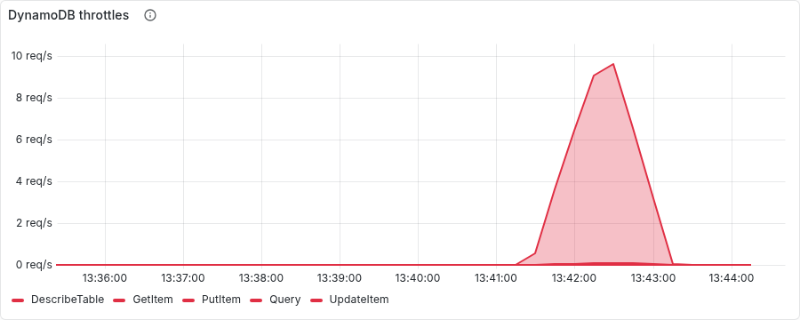
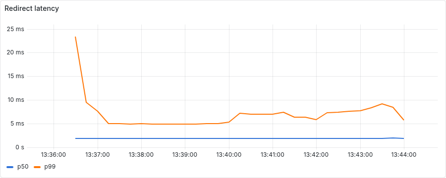

# Chaos experiment 1: DynamoDB write throttling on a hot link

Run started 2026-09-24T13:36:23+00:00, 433s end to end. Generated by `scripts/chaos/experiment1.py`; every line below is an observation the script made through Prometheus, Alertmanager or the Kubernetes API, not a description.

## Timeline

| T+ | event | detail |
|---:|---|---|
| 1s | ok: 2 ready application pods | ready: ['linkpulse-5dc697f88d-4x4nr', 'linkpulse-5dc697f88d-q5gz9'] |
| 1s | ok: no critical alert firing | [] |
| 1s | ok: prometheus is scraping the application | 2.0 targets |
| 2s | ok: no clicks being dropped for throttling |  |
| 2s | ok: LinkpulseClicksDropped not firing |  |
| 2s | starting load: k6 throttle.js, 20 redirects/s on one link |  |
| 54s | redirects arriving at >= 15/s | after 51s |
| 99s | ok: clean window: clicks recorded at >= 15/s | 20.0/s |
| 99s | ok: clean window: nothing dropped |  |
| 99s | no injection: waiting for the real table to throttle on its own |  |
| 308s | clicks dropped with reason=throttled (rate > 0) | after 209s |
| 338s | LinkpulseClicksDropped{reason=throttled} firing | after 30s |
| 338s | LinkpulseDynamoThrottled firing | after 0s |
| 339s | ok: DynamoDB reporting throttled calls | 6.6/s |
| 339s | ok: redirects still arriving at >= 15/s | 20.0/s |
| 339s | ok: no user-facing 5xx at all | ratio 0 |
| 339s | ok: redirect p99 within 250ms (alert line, or 2x the clean window) | 7ms vs clean 5ms |
| 339s | recovering: load ends; the table's bucket refills |  |
| 427s | drops back to 0/s | after 88s |
| 432s | LinkpulseClicksDropped resolved | after 5s |
| 433s | ok: k6: every redirect was a 302 |  |
| 433s | ok: k6: no failed requests |  |

## Facts

- **readyPodsAtStart**: ['linkpulse-5dc697f88d-4x4nr', 'linkpulse-5dc697f88d-q5gz9']
- **clickShards**: 16.0
- **cleanWindow**: {'redirectP99Ms': 4.9, 'clicksRecordedPerS': 20.0}
- **secondsToFirstDrop**: 209
- **secondsToAlert**: 239
- **throttleWindow**: {'redirectP99Ms': 6.7, 'redirectsPerS': 20.0, 'clicksDroppedPerS': 6.6, 'clicksRecordedPerS': 12.5, 'dynamoThrottlesPerS': 6.6, 'errorRatio': 0}
- **throttleHeldSeconds**: 240
- **secondsToResolveAfterRecovery**: 88
- **k6**: {'requests': 7202, 'p50Ms': 9.914265, 'p95Ms': 24.591364, 'p99Ms': 56.741521, 'failedRatio': 0, 'not302': 0}

## Panels

