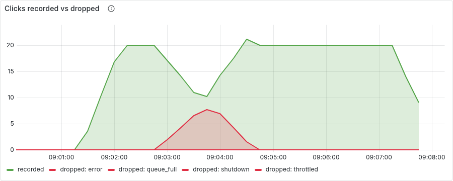
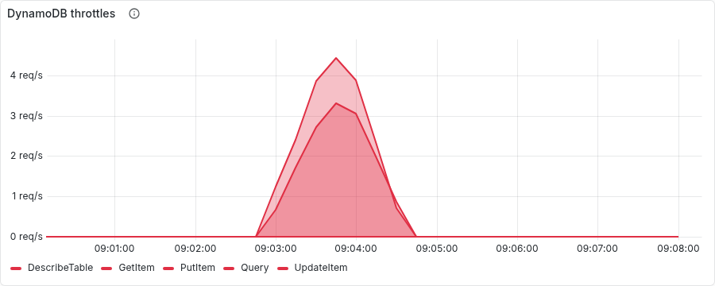
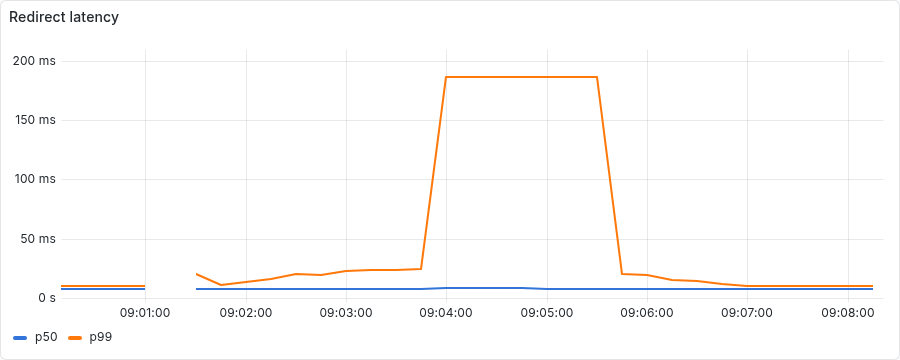

# Chaos experiment 1: DynamoDB write throttling on a hot link

Run started 2026-09-11T09:01:09+00:00, 364s end to end. Generated by `scripts/chaos/experiment1.py`; every line below is an observation the script made through Prometheus, Alertmanager or the Kubernetes API, not a description.

## Timeline

| T+ | event | detail |
|---:|---|---|
| 1s | ok: 2 ready application pods | ready: ['linkpulse-567b49654f-767gs', 'linkpulse-567b49654f-rmh7d'] |
| 1s | ok: no critical alert firing | [] |
| 1s | ok: prometheus is scraping the application | 2.0 targets |
| 1s | ok: no clicks being dropped for throttling |  |
| 1s | ok: LinkpulseClicksDropped not firing |  |
| 1s | LocalStack write-error probability confirmed 0 (injection armed, not applied) |  |
| 1s | starting load: k6 throttle.js, 20 redirects/s on one link |  |
| 43s | redirects arriving at >= 15/s | after 40s |
| 88s | ok: clean window: clicks recorded at >= 15/s | 20.0/s |
| 88s | ok: clean window: nothing dropped |  |
| 88s | injecting: DYNAMODB_WRITE_ERROR_PROBABILITY=0.5 via LocalStack config |  |
| 99s | clicks dropped with reason=throttled (rate > 0) | after 10s |
| 154s | LinkpulseClicksDropped{reason=throttled} firing | after 55s |
| 154s | LinkpulseDynamoThrottled firing | after 0s |
| 154s | ok: DynamoDB reporting throttled calls | 7.7/s |
| 154s | ok: redirects still arriving at >= 15/s | 20.0/s |
| 154s | ok: no user-facing 5xx at all | ratio 0 |
| 154s | ok: redirect p99 within 250ms (alert line, or 2x the clean window) | 25ms vs clean 21ms |
| 154s | recovering: DYNAMODB_WRITE_ERROR_PROBABILITY=0 |  |
| 209s | drops back to 0/s | after 55s |
| 229s | LinkpulseClicksDropped resolved | after 20s |
| 364s | ok: k6: every redirect was a 302 |  |
| 364s | ok: k6: no failed requests |  |

## Facts

- **readyPodsAtStart**: ['linkpulse-567b49654f-767gs', 'linkpulse-567b49654f-rmh7d']
- **clickShards**: 16.0
- **cleanWindow**: {'redirectP99Ms': 21.0, 'clicksRecordedPerS': 20.0}
- **secondsToFirstDrop**: 10
- **secondsToAlert**: 65
- **throttleWindow**: {'redirectP99Ms': 24.8, 'redirectsPerS': 20.0, 'clicksDroppedPerS': 0.6, 'clicksRecordedPerS': 10.2, 'dynamoThrottlesPerS': 7.7, 'errorRatio': 0}
- **throttleHeldSeconds**: 65
- **secondsToResolveAfterRecovery**: 55
- **k6**: {'requests': 7202, 'p50Ms': 8.32292, 'p95Ms': 13.605422, 'p99Ms': 34.744206, 'failedRatio': 0, 'not302': 0}

## Panels

