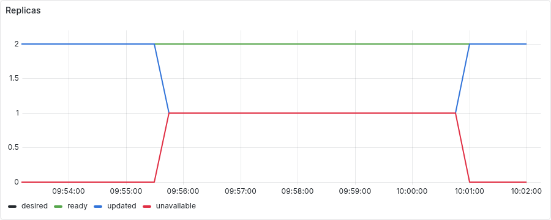
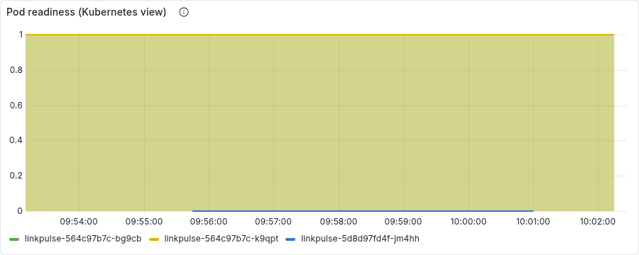

# Chaos experiment 2: bad deploy through GitOps, and the rollback

Run started 2026-09-11T09:54:11+00:00, 423s end to end. Generated by `scripts/chaos/experiment2.py`; every line below is an observation the script made through Prometheus, Alertmanager or the Kubernetes API, not a description.

## Timeline

| T+ | event | detail |
|---:|---|---|
| 0s | ok: 2 ready application pods | ready: ['linkpulse-564c97b7c-bg9cb', 'linkpulse-564c97b7c-k9qpt'] |
| 0s | ok: no critical alert firing | [] |
| 0s | ok: prometheus is scraping the application | 2.0 targets |
| 0s | ok: ArgoCD: linkpulse Synced and Healthy | {'sync': 'Synced', 'health': 'Healthy', 'revision': '3fa8a97'} |
| 0s | ok: every pod runs the same, good image | {'linkpulse-564c97b7c-bg9cb': ('linkpulse:local', True), 'linkpulse-564c97b7c-k9qpt': ('linkpulse:local', True)} |
| 0s | injecting: experiment2-git.sh break (newTag: bad, pushed to Gitea) |  |
| 86s | ArgoCD synced the bad commit fb1b956 | after 84s |
| 86s | a pod with the bad image exists | after 0s |
| 87s | ok: the old pods are still Ready (maxUnavailable: 0) | {'linkpulse-564c97b7c-bg9cb': ('linkpulse:local', True), 'linkpulse-564c97b7c-k9qpt': ('linkpulse:local', True), 'linkpulse-5d8d97fd4f-jm4hh': ('linkpulse:bad', False)} |
| 87s | ok: redirect path served by the old pods |  |
| 205s | Deployment Progressing=False (ProgressDeadlineExceeded) | after 118s |
| 206s | ok: reason is ProgressDeadlineExceeded | ProgressDeadlineExceeded |
| 287s | LinkpulseRolloutStalled firing | after 81s |
| 287s | ArgoCD reports the Application Degraded | after 0s |
| 289s | ok: the bad pod never became Ready | {'linkpulse-564c97b7c-bg9cb': ('linkpulse:local', True), 'linkpulse-564c97b7c-k9qpt': ('linkpulse:local', True), 'linkpulse-5d8d97fd4f-jm4hh': ('linkpulse:bad', False)} |
| 289s | ok: still >= 2 old pods Ready |  |
| 289s | ok: no user-facing 5xx |  |
| 289s | ok: redirect path still served |  |
| 289s | recovering: experiment2-git.sh revert (git revert, pushed) |  |
| 401s | ArgoCD synced the revert a7f704e | after 87s |
| 401s | no pod with the bad image remains | after 0s |
| 401s | Deployment Progressing=True again (NewReplicaSetAvailable) | after 0s |
| 423s | LinkpulseRolloutStalled resolved | after 22s |
| 423s | ArgoCD: Synced and Healthy | after 0s |
| 423s | ok: every pod runs the good image and is Ready | {'linkpulse-564c97b7c-bg9cb': ('linkpulse:local', True), 'linkpulse-564c97b7c-k9qpt': ('linkpulse:local', True)} |
| 423s | ok: redirect path served |  |

## Facts

- **readyPodsAtStart**: ['linkpulse-564c97b7c-bg9cb', 'linkpulse-564c97b7c-k9qpt']
- **goodImage**: linkpulse:local
- **revisionAtStart**: 3fa8a97
- **podsAtStart**: ['linkpulse-564c97b7c-bg9cb', 'linkpulse-564c97b7c-k9qpt']
- **breakRevision**: fb1b956
- **secondsToSync**: 84
- **progressingCondition**: {'reason': 'ProgressDeadlineExceeded', 'message': 'ReplicaSet "linkpulse-5d8d97fd4f" has timed out progressing.'}
- **secondsToProgressDeadline**: 204
- **secondsToAlert**: 285
- **podsDuringStall**: {'linkpulse-564c97b7c-bg9cb': ['linkpulse:local', True], 'linkpulse-564c97b7c-k9qpt': ['linkpulse:local', True], 'linkpulse-5d8d97fd4f-jm4hh': ['linkpulse:bad', False]}
- **revertRevision**: a7f704e
- **secondsToRollBack**: 109

## Panels

