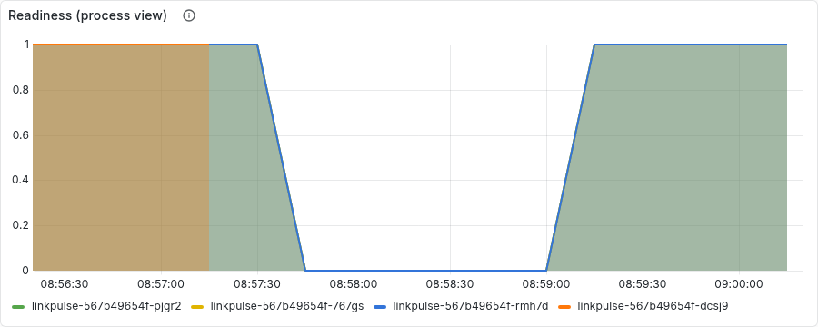
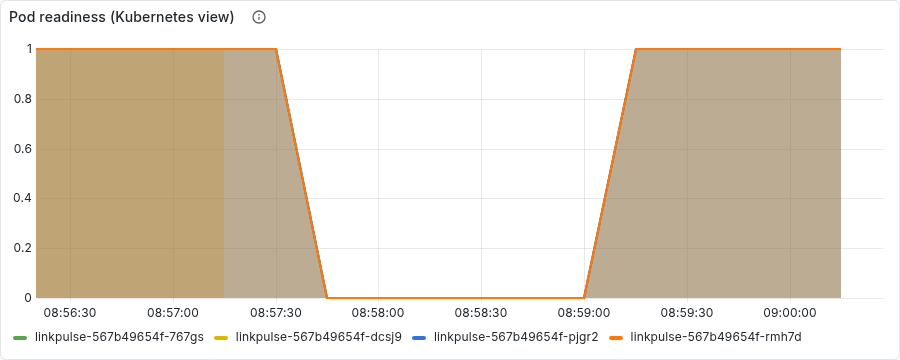
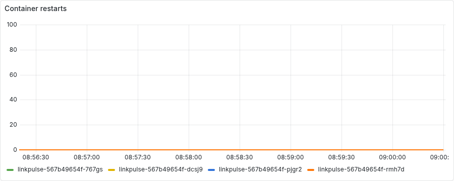

# Chaos experiment 3: dependency outage (datastore unreachable)

Run started 2026-09-11T08:57:20+00:00, 119s end to end. Generated by `scripts/chaos/experiment3.py`; every line below is an observation the script made through Prometheus, Alertmanager or the Kubernetes API, not a description.

## Timeline

| T+ | event | detail |
|---:|---|---|
| 0s | ok: 2 ready application pods | ready: ['linkpulse-567b49654f-767gs', 'linkpulse-567b49654f-pjgr2', 'linkpulse-567b49654f-rmh7d'] |
| 0s | ok: no critical alert firing | [] |
| 0s | ok: prometheus is scraping the application | 4.0 targets |
| 0s | ok: redirect path answers (404 for an unknown code) |  |
| 0s | ok: process reports ready on every pod |  |
| 0s | injecting: docker compose pause localstack |  |
| 17s | linkpulse_ready == 0 on every pod (process view) | after 15s |
| 92s | LinkpulseNotReady firing | after 75s |
| 92s | 0 ready pods (Kubernetes view) | after 0s |
| 92s | LinkpulseNoReadyPods firing | after 0s |
| 92s | LinkpulseNotReady inhibited by LinkpulseNoReadyPods | after 0s |
| 92s | ok: ingress answers 5xx with no endpoints behind the Service | HTTP 503 |
| 92s | ok: no container restarted (liveness ignores the dependency) | restarts=0.0 |
| 92s | ok: the pods are still Running, merely not Ready |  |
| 92s | recovering: docker compose unpause localstack |  |
| 99s | 2 ready pods again | after 5s |
| 119s | both alerts resolved | after 20s |
| 119s | ok: still no container restarted | restarts=0.0 |
| 119s | ok: redirect path answers again |  |

## Facts

- **readyPodsAtStart**: ['linkpulse-567b49654f-767gs', 'linkpulse-567b49654f-pjgr2', 'linkpulse-567b49654f-rmh7d']
- **restartsAtStart**: 0.0
- **secondsToProcessNotReady**: 15
- **secondsToNotReadyAlert**: 90
- **secondsToKubernetesNotReady**: 90
- **secondsToNoReadyPodsAlert**: 90
- **secondsToRecoverReady**: 5

## Panels

