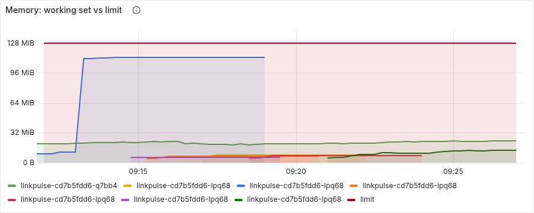
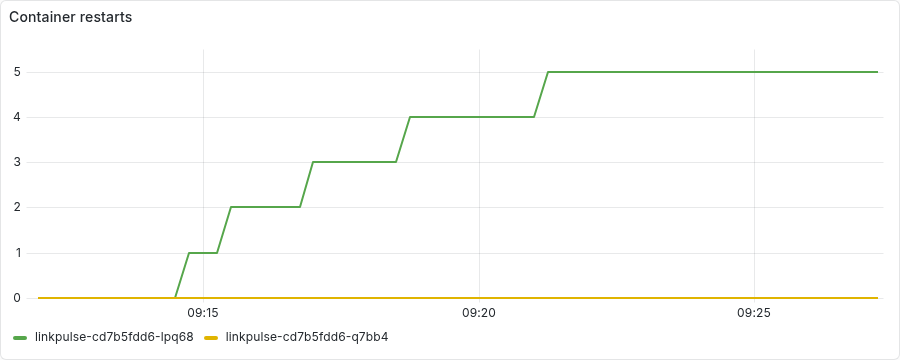
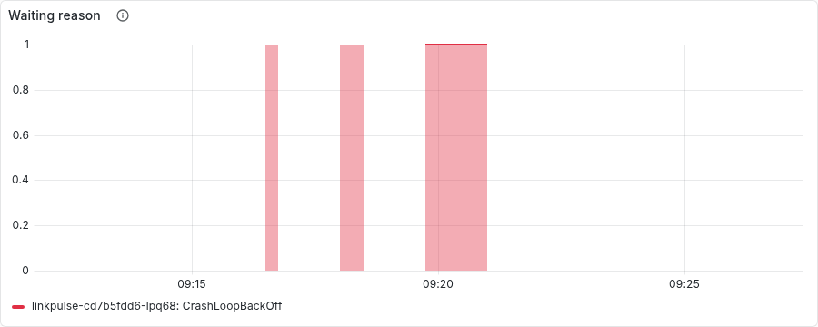
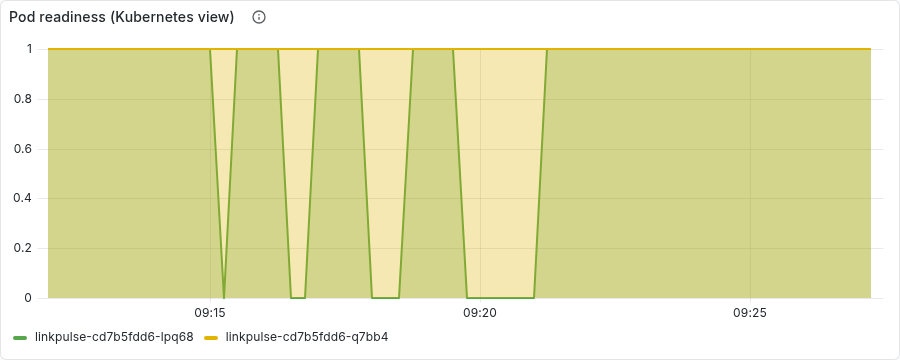

# Chaos experiment 4: resource exhaustion (OOMKilled to CrashLoopBackOff)

Run started 2026-09-11T09:12:47+00:00, 807s end to end. Generated by `scripts/chaos/experiment4.py`; every line below is an observation the script made through Prometheus, Alertmanager or the Kubernetes API, not a description.

## Timeline

| T+ | event | detail |
|---:|---|---|
| 0s | ok: 2 ready application pods | ready: ['linkpulse-cd7b5fdd6-lpq68', 'linkpulse-cd7b5fdd6-q7bb4'] |
| 0s | ok: no critical alert firing | [] |
| 0s | ok: prometheus is scraping the application | 2.0 targets |
| 1s | ok: /debug/leak is routed on the target (400 without mb) | HTTP 400; is LINKPULSE_ENABLE_DEBUG_LEAK=true in the local overlay and rolled out? |
| 1s | target: linkpulse-cd7b5fdd6-lpq68; the other replica must keep serving throughout |  |
| 2s | linkpulse-cd7b5fdd6-lpq68 container running | after 0s |
| 4s | leaked to 100 MB retained | limit 128Mi |
| 19s | working set above 85% of the limit (Prometheus view) | after 15s |
| 94s | LinkpulseMemoryNearLimit firing | after 75s |
| 94s | pushing over the limit: +40 MB |  |
| 107s | linkpulse-cd7b5fdd6-lpq68 restarted (restart count 0 -> 1) | after 12s |
| 107s | ok: last termination reason is OOMKilled | OOMKilled |
| 127s | LinkpulseOOMKilled firing | after 20s |
| 127s | ok: the other replica is serving through the ingress |  |
| 127s | linkpulse-cd7b5fdd6-lpq68 container running | after 0s |
| 128s | leaked to 100 MB retained | limit 128Mi |
| 128s | pushing over the limit: +40 MB |  |
| 150s | linkpulse-cd7b5fdd6-lpq68 restarted (restart count 1 -> 2) | after 21s |
| 150s | ok: last termination reason is OOMKilled | OOMKilled |
| 151s | after kill 2: waiting reason None |  |
| 196s | **TIMEOUT waiting for LinkpulseCrashLooping firing** | 45s |
| 196s | linkpulse-cd7b5fdd6-lpq68 container running | after 0s |
| 197s | leaked to 100 MB retained | limit 128Mi |
| 197s | pushing over the limit: +40 MB |  |
| 243s | linkpulse-cd7b5fdd6-lpq68 restarted (restart count 2 -> 3) | after 45s |
| 243s | ok: last termination reason is OOMKilled | OOMKilled |
| 243s | after kill 3: waiting reason None |  |
| 288s | **TIMEOUT waiting for LinkpulseCrashLooping firing** | 45s |
| 288s | linkpulse-cd7b5fdd6-lpq68 container running | after 0s |
| 289s | leaked to 100 MB retained | limit 128Mi |
| 289s | pushing over the limit: +40 MB |  |
| 347s | linkpulse-cd7b5fdd6-lpq68 restarted (restart count 3 -> 4) | after 57s |
| 347s | ok: last termination reason is OOMKilled | OOMKilled |
| 347s | after kill 4: waiting reason None |  |
| 392s | **TIMEOUT waiting for LinkpulseCrashLooping firing** | 45s |
| 392s | linkpulse-cd7b5fdd6-lpq68 container running | after 0s |
| 393s | leaked to 100 MB retained | limit 128Mi |
| 393s | pushing over the limit: +40 MB |  |
| 496s | linkpulse-cd7b5fdd6-lpq68 restarted (restart count 4 -> 5) | after 102s |
| 496s | ok: last termination reason is OOMKilled | OOMKilled |
| 497s | after kill 5: waiting reason None |  |
| 497s | ok: LinkpulseCrashLooping firing |  |
| 497s | ok: the other replica is still serving through the ingress |  |
| 497s | recovering: no more leaks; the kubelet restarts the container on its own |  |
| 597s | linkpulse-cd7b5fdd6-lpq68 running and ready again (after the last backoff) | after 0s |
| 597s | LinkpulseCrashLooping resolved | after 0s |
| 597s | LinkpulseMemoryNearLimit resolved | after 0s |
| 807s | LinkpulseOOMKilled resolved (5m window elapsed) | after 210s |
| 807s | ok: 2 ready pods | ['linkpulse-cd7b5fdd6-lpq68', 'linkpulse-cd7b5fdd6-q7bb4'] |
| 807s | ok: the restart count is the evidence, not a symptom: still recorded |  |

## Facts

- **readyPodsAtStart**: ['linkpulse-cd7b5fdd6-lpq68', 'linkpulse-cd7b5fdd6-q7bb4']
- **targetPod**: linkpulse-cd7b5fdd6-lpq68
- **otherPods**: ['linkpulse-cd7b5fdd6-q7bb4']
- **restartsAtStart**: 0.0
- **secondsToFirstOOMKill**: 105
- **secondsToOOMKilledAlert**: 125
- **killsToCrashLoopAlert**: 5
- **secondsToCrashLoopAlert**: 495
- **restartsAtPeak**: 5.0
- **belowMinReplicasAlertSeen**: False
- **secondsToRecoverAfterLastKill**: 0

## Panels

