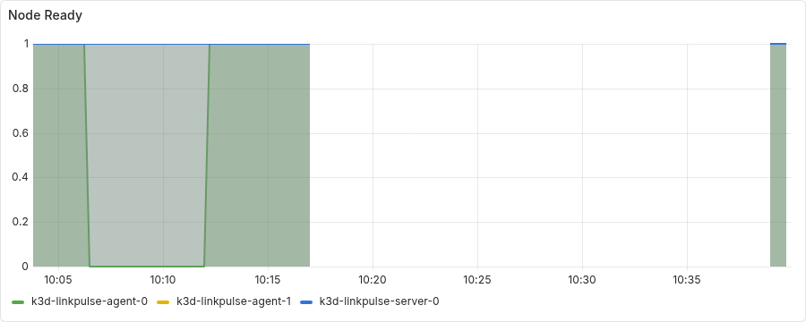
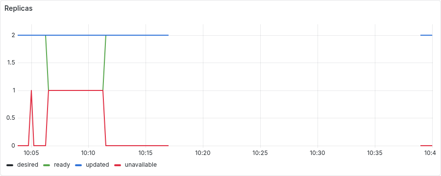
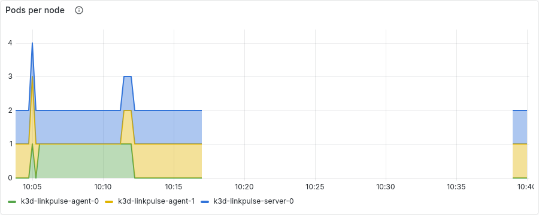
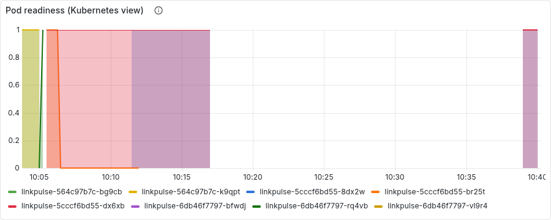

# Chaos experiment 5: node loss (drain, then a stopped node)

Run started 2026-09-11T10:04:49+00:00, 2049s end to end. Generated by `scripts/chaos/experiment5.py`; every line below is an observation the script made through Prometheus, Alertmanager or the Kubernetes API, not a description.

## Timeline

| T+ | event | detail |
|---:|---|---|
| 0s | ok: 2 ready application pods | ready: ['linkpulse-564c97b7c-bg9cb', 'linkpulse-564c97b7c-k9qpt'] |
| 0s | ok: no critical alert firing | [] |
| 0s | ok: prometheus is scraping the application | 2.0 targets |
| 1s | ok: PDB allows exactly one disruption at two replicas | 1 |
| 1s | ok: the target node is Ready |  |
| 1s | no replica on the target; rolling the deployment to re-spread |  |
| 7s | a replica on k3d-linkpulse-agent-0, 2 ready | after 1s |
| 8s | target: k3d-linkpulse-agent-0 | hosting ['linkpulse-6db46f7797-vl9r4'] |
| 10s | kubectl drain k3d-linkpulse-agent-0 --pod-selector app.kubernetes.io/name=linkpulse | evicting ['linkpulse-6db46f7797-vl9r4'] |
| 17s | drain returned | node/k3d-linkpulse-agent-0 drained |
| 17s | ok: the node is cordoned |  |
| 18s | ok: no application pod remains on the node | {'k3d-linkpulse-server-0': ['linkpulse-6db46f7797-bfwdj'], 'k3d-linkpulse-agent-1': ['linkpulse-6db46f7797-rq4vb']} |
| 18s | 2 ready replicas again, on other nodes | after 0s |
| 21s | ok: redirect path served throughout (one replica was always ready) |  |
| 22s | node uncordoned | after 0s |
| 22s | rolling the deployment so a replica lands back on the target |  |
| 29s | a replica scheduled on k3d-linkpulse-agent-0, 2 ready | after 1s |
| 29s | injecting: k3d node stop k3d-linkpulse-agent-0 |  |
| 33s | ok: a replica was on the node when it stopped | {'k3d-linkpulse-agent-0': ['linkpulse-5cccf6bd55-br25t'], 'k3d-linkpulse-server-0': ['linkpulse-5cccf6bd55-dx6xb']} |
| 84s | k3d-linkpulse-agent-0 NotReady (Kubernetes view) | after 51s |
| 181s | KubeNodeNotReady firing | after 96s |
| 181s | fewer ready replicas than the HPA minimum | after 0s |
| 181s | LinkpulseBelowMinReplicas firing | after 0s |
| 181s | ok: redirect path still served by the surviving replica |  |
| 388s | replacement replica ready elsewhere (2 ready again) | after 207s |
| 390s | the deployment sat below its minimum for ~285s (Prometheus, 15s samples) |  |
| 391s | ok: redirect path served throughout |  |
| 423s | LinkpulseBelowMinReplicas resolved | after 32s |
| 423s | recovering: k3d node start k3d-linkpulse-agent-0 |  |
| 431s | k3d-linkpulse-agent-0 Ready again | after 4s |
| 2047s | KubeNodeNotReady resolved | after 1616s |
| 2047s | the pod stranded on the node is cleaned up | after 0s |
| 2048s | ok: 2 ready replicas | ['linkpulse-5cccf6bd55-8dx2w', 'linkpulse-5cccf6bd55-dx6xb'] |
| 2048s | ok: PDB allows one disruption again | 1 |

## Facts

- **readyPodsAtStart**: ['linkpulse-564c97b7c-bg9cb', 'linkpulse-564c97b7c-k9qpt']
- **targetNode**: k3d-linkpulse-agent-0
- **pdbDisruptionsAllowedAtStart**: 1
- **singletonsMovedOffTarget**: []
- **podsByNodeAtStart**: {'k3d-linkpulse-agent-1': ['linkpulse-6db46f7797-rq4vb'], 'k3d-linkpulse-agent-0': ['linkpulse-6db46f7797-vl9r4']}
- **drainSeconds**: 7
- **drainSecondsToTwoReady**: 8
- **podsByNodeAfterDrain**: {'k3d-linkpulse-server-0': ['linkpulse-6db46f7797-bfwdj'], 'k3d-linkpulse-agent-1': ['linkpulse-6db46f7797-rq4vb']}
- **belowMinReplicasDuringDrain**: None
- **podsByNodeBeforeStop**: {'k3d-linkpulse-agent-0': ['linkpulse-5cccf6bd55-br25t'], 'k3d-linkpulse-server-0': ['linkpulse-5cccf6bd55-dx6xb']}
- **podsOnNodeAtStop**: ['linkpulse-5cccf6bd55-br25t']
- **collateralOnNodeAtStop**: []
- **secondsToNodeNotReady**: 51
- **secondsToNodeAlert**: 147
- **secondsToBelowMinReplicasAlert**: 147
- **secondsBelowMinReplicas**: 285
- **podsByNodeAfterReplacement**: {'k3d-linkpulse-agent-1': ['linkpulse-5cccf6bd55-8dx2w'], 'k3d-linkpulse-server-0': ['linkpulse-5cccf6bd55-dx6xb']}
- **secondsToNodeReady**: 4
- **podsByNodeAtEnd**: {'k3d-linkpulse-agent-1': ['linkpulse-5cccf6bd55-8dx2w'], 'k3d-linkpulse-server-0': ['linkpulse-5cccf6bd55-dx6xb']}

## Panels

